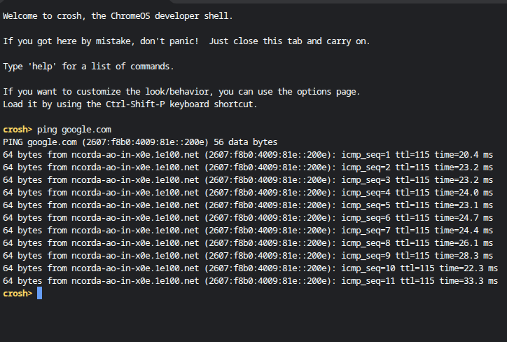

}
# IP Configuration Commands

## Project Summary
In this project, I practiced using command line tools to view and understand IP configuration details on my device.

## Tools Used
- Command Prompt / Terminal
- ipconfig command

## Environment
- Chromebook (Crosh/Terminal)

## What I Did
I used the ipconfig command to check my device’s IP address, default gateway, and network configuration.

## Steps Performed
1. Opened terminal  
2. Ran ipconfig (or ifconfig)  
3. Reviewed IP address and network details  
4. Identified default gateway  

## Results
The command displayed my device’s network configuration, confirming connection to the network.

## Screenshots

## Conclusion
This project helped me understand how to check network settings and troubleshoot connectivity issues
